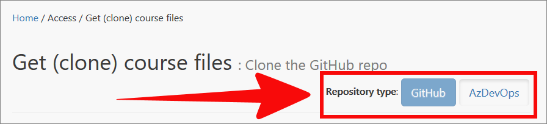

# Welcome to WayPoint Ventures documentation

The WayPoint Ventures documentation website provides guides, videos and resources to help you develop, review, edit and prepare course content.

## How to use this website

The **Quick Start** (from the left side menu) provides a guide to contributing content on a single page. Authors, Reviewers and other contributors will find the quick start useful to understanding what is required to "get up and running" quickly.

Alternatively, you can choose a single topic from the left side menu. If you are a new contributor, after you complete the guides in the **Install software** section, the guide to [Terminology and concepts]({{site.baseurl}}/workflow/terminology.html) is good to start with.

>**Note**: Some of the documents on this site are specific to courses that use **GitHub**, while others are specific to courses that use **Azure DevOps** (AzDevOps). Use the **Repository type** button, as shown in the following image, to select **GitHub** or **Azure DevOps**, in accordance with the requirements for the course you are working on. If you are unsure about the type of repository used by the course you are working on, ask your project manager.
>
> 

## Prerequisites

Before you proceed, note the following prerequisites:

### GitHub courses

- You need a GitHub user account to complete the guides on this website. If you do not have a GitHub account, create one using the [GitHub account setup guide](https://docs.microsoft.com/contribute/get-started-setup-github). Choose a GitHub username that will distinguish you and your contributions from others on GitHub. For example, use a variation of your first and/ or second name as your GitHub username.
- The email address associated with your GitHub user account, and your GitHub username, are required to complete the guides.
- The project's GitHub repo is private. You must receive and accept an invitation to access the project's GitHub repo and make contributions. When you create your GitHub account, send an email to your project manager requesting access to the project's GitHub repo.

### Azure DevOps courses

- You need a... TODO.
